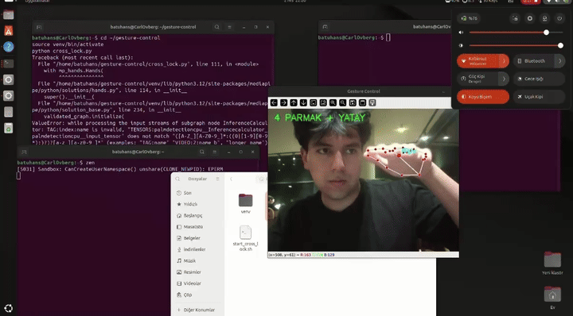

# Gesture Control

A real-time computer-vision system that maps hand gestures captured from a standard webcam to operating-system actions — locking the screen and controlling audio volume — without any additional hardware. Built with OpenCV and MediaPipe on Linux.

<!--
  DEMO — highest priority. Record a 5–8 second clip (cross gesture -> palms -> screen locks)
  with `peek` or `byzanz` on Ubuntu, save it as docs/demo.gif in the repo, then uncomment:

  
-->

## Motivation

I wanted to explore how far a purely vision-based interface could go using only a laptop webcam — no depth camera, no wearable sensors. The interesting problem was not detecting a hand, which MediaPipe handles, but making a gesture interface *reliable enough to trust with a real system action*. Locking a screen by accident is annoying; triggering it on a stray movement makes the whole idea useless. Most of the engineering here is about avoiding false positives, not about recognising gestures.

## How it works

The system is driven by a small **finite state machine** rather than firing an action the moment a gesture is seen. This is the core of its reliability.

**Screen lock (two-stage confirmation):**

1. **Waiting for cross** — the user crosses both hands. Crossing is verified using MediaPipe *handedness*: the detected "Right" hand must actually be positioned left of the "Left" hand (and vice versa), the hands must be close enough, and at a similar height. The cross must be held for a short debounce period (`CROSS_HOLD_TIME`, 0.35 s) so that a momentary overlap does not count.
2. **Confirmation window** — the system then opens a timed window (`PALM_WINDOW_TIME`, default 4 s). The screen only locks if the user now shows **both open palms, clearly separated**. If the window expires, the action is cancelled.

This deliberate two-step "arm, then confirm" design is what makes the lock trustworthy: a single accidental gesture can never lock the screen on its own. A cooldown (`LOCK_COOLDOWN`) prevents repeated triggers.

**Volume control (single hand):**

Showing four fingers up with the hand held roughly horizontal puts the system in volume mode. Vertical hand motion is tracked over a short rolling history (a `deque`) so that direction is measured from smoothed movement rather than a single noisy frame — moving up raises the volume, moving down lowers it, throttled by a short cooldown.

## Technologies

- Python 3
- OpenCV — webcam capture and on-screen feedback
- MediaPipe — hand landmark detection and tracking
- Linux system utilities: `loginctl` (screen lock), `pactl` (volume)

## Installation

    sudo apt update
    sudo apt install python3-pip
    pip install -r requirements.txt

## Usage

    python cross_lock.py

Press `q` to quit. On-screen text shows the current state (waiting for cross, confirmation countdown, volume mode) for live feedback and debugging.

## Project structure

    gesture-control/
    ├── cross_lock.py        # Main application: state machine, gesture logic, actions
    ├── fist_lock.py         # Alternative gesture experiment
    ├── test_hand.py         # Landmark / detection testing utility
    ├── lock_watcher.sh      # Background lock watcher
    ├── launch_watcher.sh    # Auto-launch handler
    ├── start_cross_lock.sh  # Startup script
    └── requirements.txt

## Design notes and limitations

- Tested on Ubuntu; the action layer (`loginctl`, `pactl`) is Linux-specific.
- Detection quality depends on lighting and camera resolution.
- Thresholds (hold time, confirmation window, distance ratios) are exposed as constants at the top of `cross_lock.py` so behaviour can be tuned without touching the core logic.

## Possible extensions

- Replace the hand-tuned geometric rules with a small trained gesture classifier.
- A configuration file for user-defined gestures and actions.
- Cross-platform action backends (Windows / macOS).

## Author

Batuhan Sevindik — Informatik student, Universität Paderborn.
EOFcat > README.md <<'EOF'
# Gesture Control

A real-time computer-vision system that maps hand gestures captured from a standard webcam to operating-system actions — locking the screen and controlling audio volume — without any additional hardware. Built with OpenCV and MediaPipe on Linux.

<!--
  DEMO — highest priority. Record a 5–8 second clip (cross gesture -> palms -> screen locks)
  with `peek` or `byzanz` on Ubuntu, save it as docs/demo.gif in the repo, then uncomment:

  
-->

## Motivation

I wanted to explore how far a purely vision-based interface could go using only a laptop webcam — no depth camera, no wearable sensors. The interesting problem was not detecting a hand, which MediaPipe handles, but making a gesture interface *reliable enough to trust with a real system action*. Locking a screen by accident is annoying; triggering it on a stray movement makes the whole idea useless. Most of the engineering here is about avoiding false positives, not about recognising gestures.

## How it works

The system is driven by a small **finite state machine** rather than firing an action the moment a gesture is seen. This is the core of its reliability.

**Screen lock (two-stage confirmation):**

1. **Waiting for cross** — the user crosses both hands. Crossing is verified using MediaPipe *handedness*: the detected "Right" hand must actually be positioned left of the "Left" hand (and vice versa), the hands must be close enough, and at a similar height. The cross must be held for a short debounce period (`CROSS_HOLD_TIME`, 0.35 s) so that a momentary overlap does not count.
2. **Confirmation window** — the system then opens a timed window (`PALM_WINDOW_TIME`, default 4 s). The screen only locks if the user now shows **both open palms, clearly separated**. If the window expires, the action is cancelled.

This deliberate two-step "arm, then confirm" design is what makes the lock trustworthy: a single accidental gesture can never lock the screen on its own. A cooldown (`LOCK_COOLDOWN`) prevents repeated triggers.

**Volume control (single hand):**

Showing four fingers up with the hand held roughly horizontal puts the system in volume mode. Vertical hand motion is tracked over a short rolling history (a `deque`) so that direction is measured from smoothed movement rather than a single noisy frame — moving up raises the volume, moving down lowers it, throttled by a short cooldown.

## Technologies

- Python 3
- OpenCV — webcam capture and on-screen feedback
- MediaPipe — hand landmark detection and tracking
- Linux system utilities: `loginctl` (screen lock), `pactl` (volume)

## Installation

    sudo apt update
    sudo apt install python3-pip
    pip install -r requirements.txt

## Usage

    python cross_lock.py

Press `q` to quit. On-screen text shows the current state (waiting for cross, confirmation countdown, volume mode) for live feedback and debugging.

## Project structure

    gesture-control/
    ├── cross_lock.py        # Main application: state machine, gesture logic, actions
    ├── fist_lock.py         # Alternative gesture experiment
    ├── test_hand.py         # Landmark / detection testing utility
    ├── lock_watcher.sh      # Background lock watcher
    ├── launch_watcher.sh    # Auto-launch handler
    ├── start_cross_lock.sh  # Startup script
    └── requirements.txt

## Design notes and limitations

- Tested on Ubuntu; the action layer (`loginctl`, `pactl`) is Linux-specific.
- Detection quality depends on lighting and camera resolution.
- Thresholds (hold time, confirmation window, distance ratios) are exposed as constants at the top of `cross_lock.py` so behaviour can be tuned without touching the core logic.

## Possible extensions

- Replace the hand-tuned geometric rules with a small trained gesture classifier.
- A configuration file for user-defined gestures and actions.
- Cross-platform action backends (Windows / macOS).

## Author

Batuhan Sevindik — Informatik student, Universität Paderborn.
